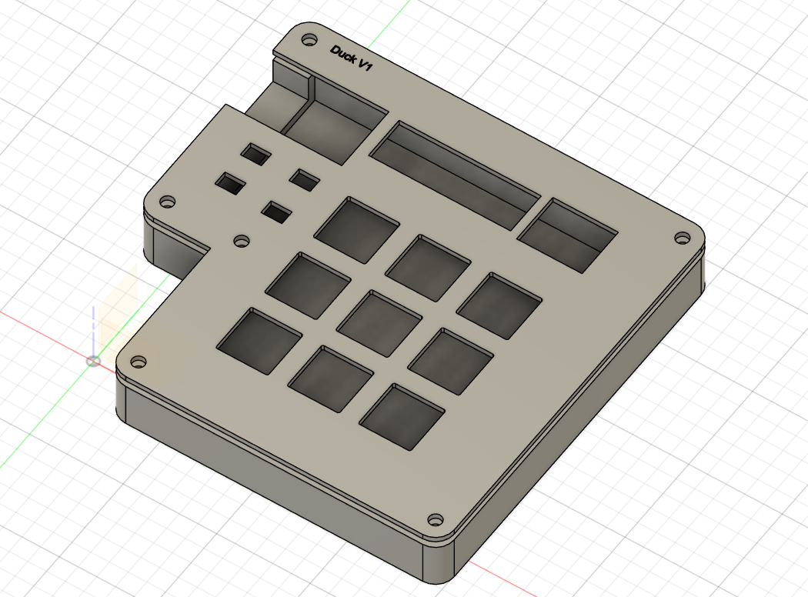
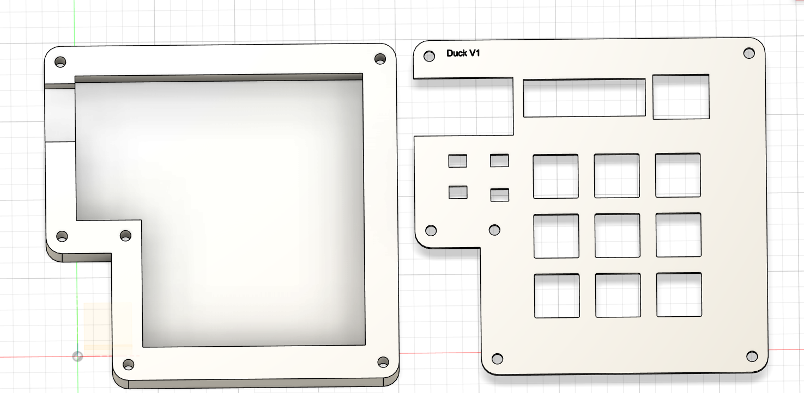
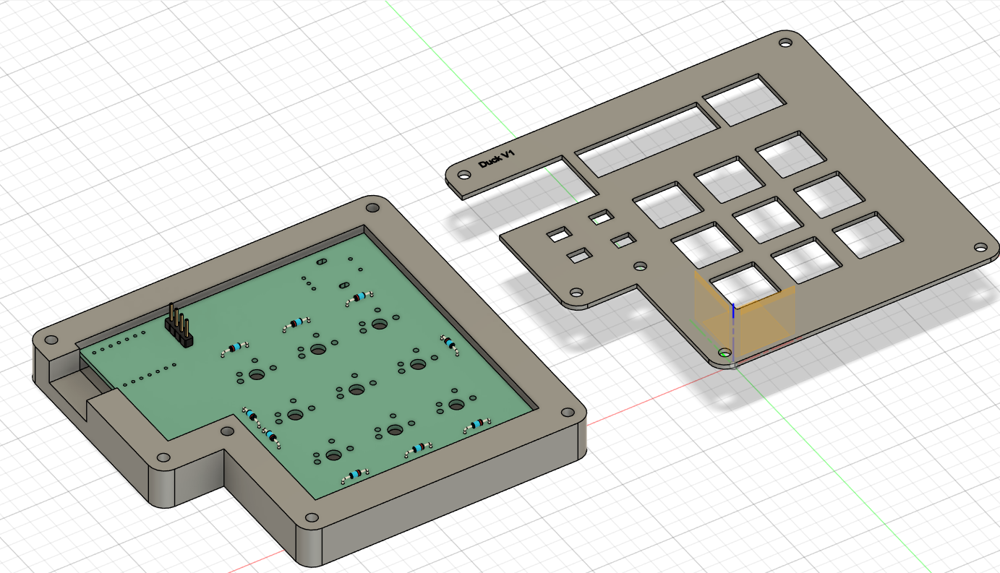
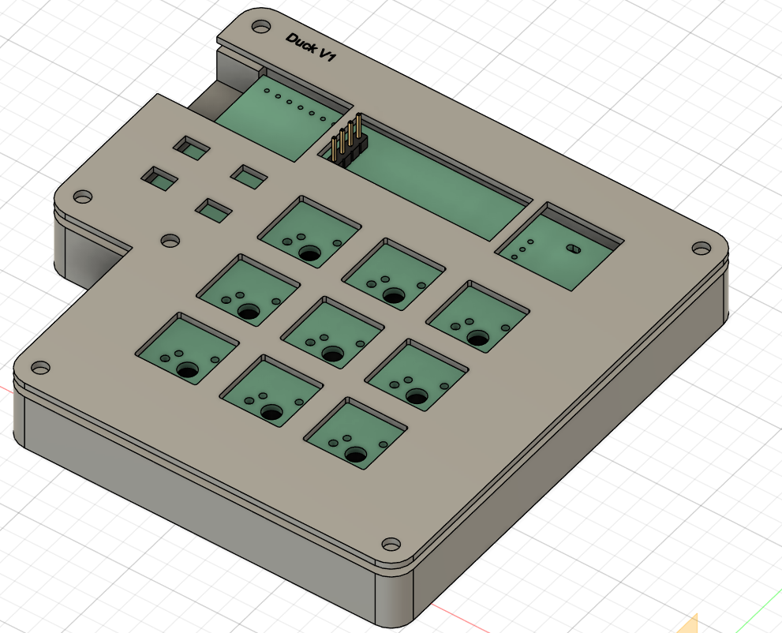
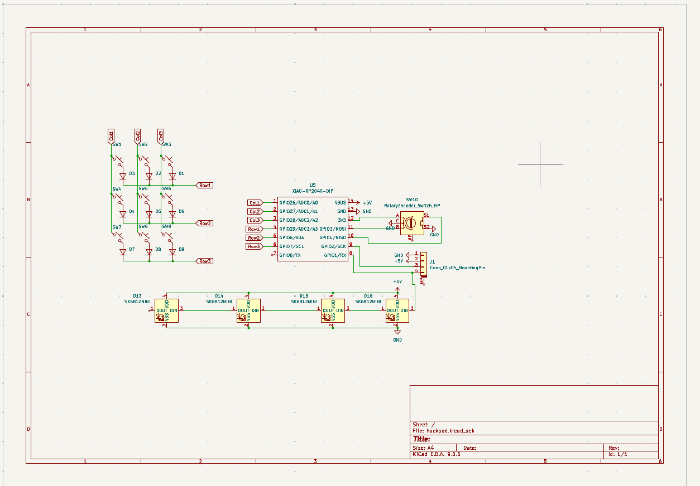
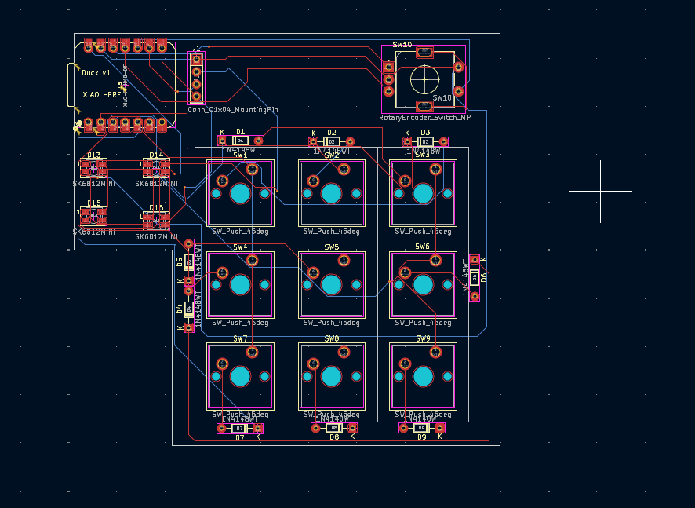
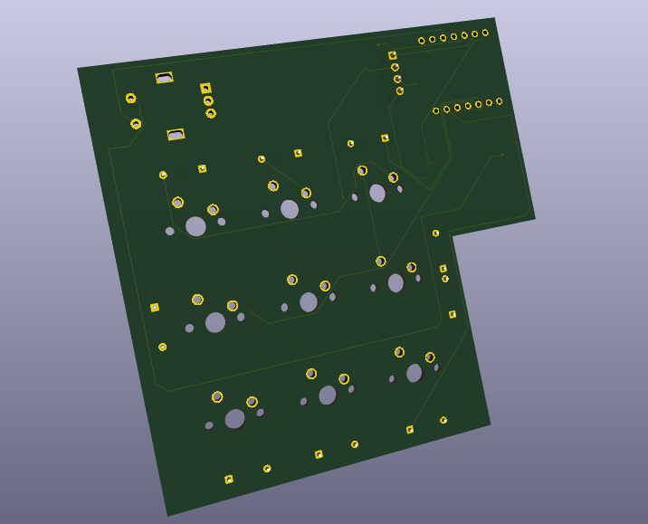
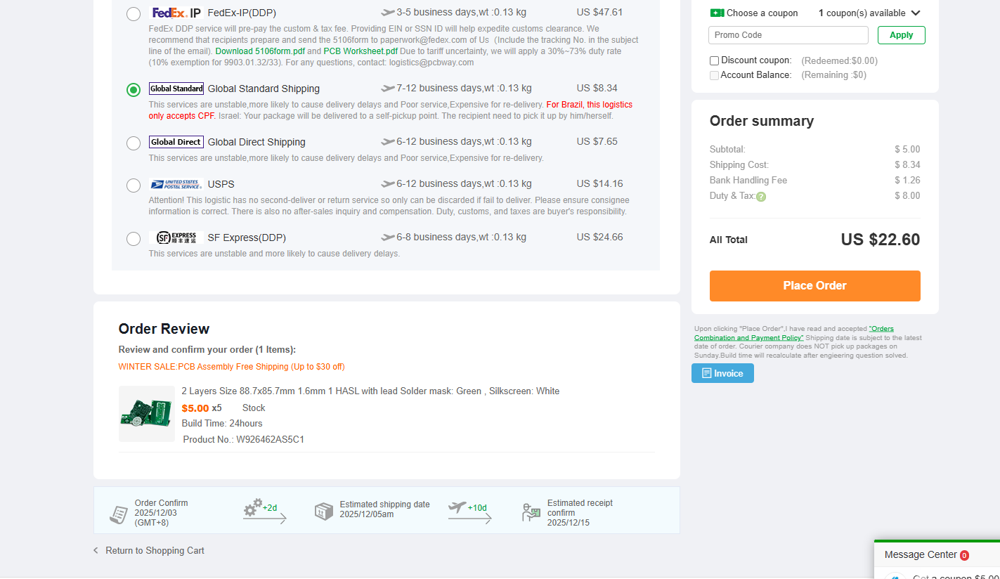
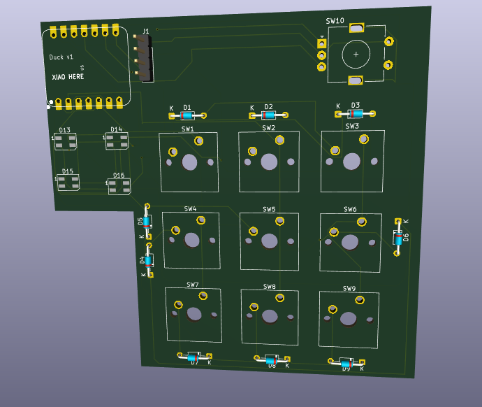

# Duck v1 Hackpad
Hackpad for blueprint!

This is a small 9-key macropad with a rotary encoder, OLED display, and SK6812 MINI-E RGB LEDs.  

I usually only make CAD models, so this was my first time properly making a PCB-really fun!!!

Designed to be a compact editing/drawing pad.

## Features
- 3×3 layout 
- EC11 rotary encoder 
- 0.91" 128×32 SSD1306 OLED display 
- 4× SK6812 MINI-E RGB LEDs 
- Seeed XIAO RP2040

## CAD Model
Made in Fusion360. Everything fits together with heatset inserts and M3 screws.  

---

## PCB

Schematic | PCB Front | PCB Back
:-------:|:---------:|:--------:
 |  | 

Cost estimate:

Rendered PCB:

---

## Firmware Overview
This macropad uses QMK-style firmware! (Still need to make it though...)

---

## BOM
Every part used for this macropad is listed below (also available in `BOM.csv`):

- 9× MX mechanical switches
- 9× DSA keycaps (or any MX-compatible cap)
- 9× 1N4148 diodes (through-hole)
- 1× XIAO RP2040
- 1× EC11 rotary encoder (KY-040 module or bare EC11)
- 1× 0.91" 128×32 OLED Display (GND–VCC–SCL–SDA)
- 4× SK6812 MINI-E addressable RGB LEDs
- 6× M3×5×4 mm heatset inserts
- 6× M3×16 mm screws
- 1× Custom PCB
- 1× 3D-printed case (top + bottom)

---
